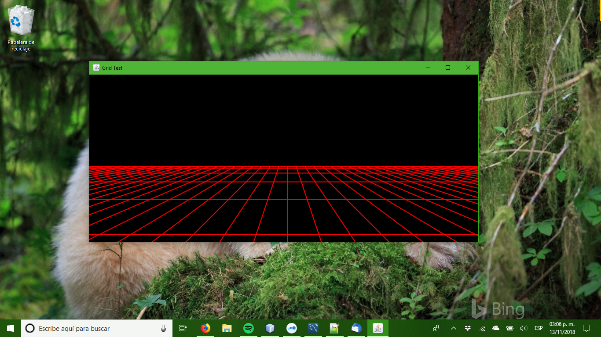

#Uso basico de Java2D




Una de las capacidades de las librerias de Java para la creación de interfaces
graficas es el poder generar graficas directamente, ya sea en pantalla o en
memoria para despues exportalas a un archivo de imagen, estas capacidades estan
contenidas en la líbreria Java2D, de la cual veremos un pequeño ejemplo de
como se usa.

## Graphics2D
Para generar nuestra grafica haremos uso del objeto Graphics2D, este objeto
contiene los métodos para especificar cosas como el color de trazo, tamaño de 
trazo, fondo, si se usara o no antialiasing, entre otras caracteristicas.

Tambien contiene el método draw el cual dibujara la implementación de la 
interfaz Shape que le pasemos como argumento con el tipo de trazo y colores 
especificados.

Obviamente hay mucho mas de Graphics2D que solo dibujar lineas y figuras, como
por ejemplo el método drawImage que dibuja imagenes ya existentes, pero eso sera
para otra entrada.

## Dibujar graficas en pantalla
La forma mas sencilla de dibujar graficas en la pantalla consiste en crear un
nuevo componente de Swing en el cual crearemos la grafica deseada, esto es mucho
mas sencillo de lo que suena, basta con crear una subclase de *JComponent* y
redefinir el método *draw*, como se ve a continuación:

```java
public class GridTest extends JComponent {
   @Override
   public void paint(Graphics g){
   }
}
```

Esta clase se puede usar como cualquier otro componente Swing agregandola a un
objeto *Panel* para mostrarlo en pantalla.

## Comandos de dibujo
La forma en que se usa el objeto Graphics2D es la siguiente:

* Especificamos las propiedades del objeto Graphics2D, color de trazo, color de fondo, tipo de trazo y antialiasing.
* Le pasamos un objeto que implemente la interfaz *Shape* a la función *draw* de Graphics2D.
* Repetimos lo anterios hasta terminar nuestra grafica.

La mayoria de los objetos que implamentan *Shape* le pediran las cordenadas y 
similares asi que documentese de las figuras que desea dibujar.

##Ejemplo

Hagamos algo mas elaborado que nada mas dibujar un punto en pantalla, algo que
muestra lo que se puede hacer.

Lo que haremos sera dibujar una cuadricula con algo de perspectiva, para eso
usaremos objetos *Line2D*  y con ayuda de unos ciclos for crearemos el efecto
de prespectiva aumentando la inclinación y espaciado.


GridTest.java

```java
package mx.com.hashCode.grid;


import javax.swing.*;
import java.awt.*;
import java.awt.geom.Line2D;

public class GridTest extends JComponent {    
    
    @Override
    public void paint(Graphics g){
        Graphics2D graficas = (Graphics2D) g;
        // Indicamos que queremos se use antialiasing al hacer las lineas
        graficas.setRenderingHint(RenderingHints.KEY_ANTIALIASING, RenderingHints.VALUE_ANTIALIAS_ON);
        
        // Fondo
        graficas.setColor(Color.BLACK);
        graficas.fillRect(0, 0, getWidth(), getHeight());
        
        // Grueso y color de linea
        graficas.setStroke(new BasicStroke(2f));
        graficas.setColor(Color.RED);
        
        // Dibujamos las lineas verticales de la cuadricula, empezando del centro
        // hacia la izquierda
        for(int i = 450, x=450; i > 0; i -= 20, x-=90) {
            graficas.draw(new Line2D.Double(i, 210, x, 420));
        }
        
        // Luego del centro a la derecha
        for(int i = 450, x=450; i <= 900; i += 20, x+=90) {
            graficas.draw(new Line2D.Double(i, 210, x, 420));
        }

        // Ahora dibujamos las lineas horizontales
        int y = 209;
        int incremento = 5;
        
        // la distancia vertical se incrementa para dar perspectiva
        while(y < 420) {
            graficas.draw(new Line2D.Double(0, y, 900, y));
            y = y + incremento;
            incremento = incremento + incremento;
        }
    }
    
    public static void main(String[] args) {
        // Creamos una ventana para mostrar las graficas
        JFrame frame = new JFrame("Grid Test");
        
        // Nuestro nuevo componente con la grafica
        GridTest grid = new GridTest();
        
        // Operacion de salida por defecto
        frame.setDefaultCloseOperation(JFrame.EXIT_ON_CLOSE);
        
        // Agregamos el componente con la grafica
        frame.getContentPane().add(grid);
        
        // Especificamos dimensiones
        frame.pack();
        frame.setSize(new Dimension(900, 420));
        
        // Mostramos la ventana
        frame.setVisible(true);
    }
}
```

Ya que compile el programa el resultado lucira como la imagen en la parte superior
de la entrada.

Espero que la entrada les fuera de utilidad y nos vemos en la próxima :D.
